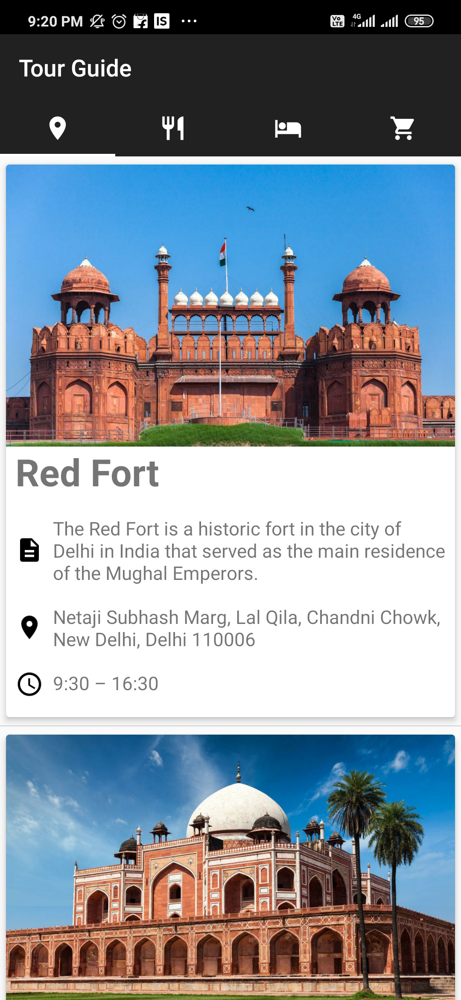

# Udacity-Android-Basic-Tour-Guide-App
Tour Guide App
===================================

This app displays lists of famous places, restaurants, hotels and shopping centers of delhi.
Used in a Udacity course in the Beginning Android Nanodegree.

## Screenshots
<table>
<tr>
<td></td>
<td></td>
</tr>
<tr>
<td></td>
<td></td>
</tr>
</table>
